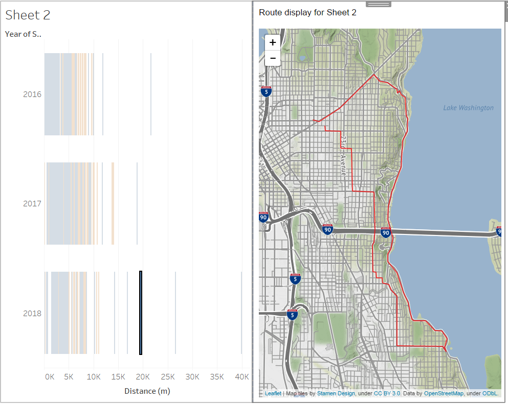

# PolylineViewer

Tableau extensions are web applications that can interact and communicate with Tableau. This application lets you visualize an encoded polyline from your data.

Requirements
- you must have Tableau Desktop 2018.2 to use extensions. 
- Works on server also - needs to whitelist extension URL by admin
- must be online to run this extension

Usage:
- download ./PolylineViewer.trex and save to a folder on your machine
- open the workbook that contains your data and **create a Sheet** which has fields named `polyline` (geometry in Google polyline format), `name` (goes to map tooltip) and `color` (HTML color name or code). Table would be fine, maybe works with others too
- **Create a Dashboard**. Add first the sheet you want to select marks from to map.
- From the Objects panel (left of Dashboard creation), select 'Extension' to add an Extension panel to your Dashboard. In the dialog that appears, select 'My Extensions' and browse to the directory where you saved the file earlier. Select `PolylineViewer.trex`
- Now with the extension available in your dashboard, select from which sheet data is loaded.
- End-user has to **select items from the sheet** and see them mapped out!

Example: 
Using the Strava web data connector, I can pull down only my activity data (no huge GPS download) and still render maps of my rides

